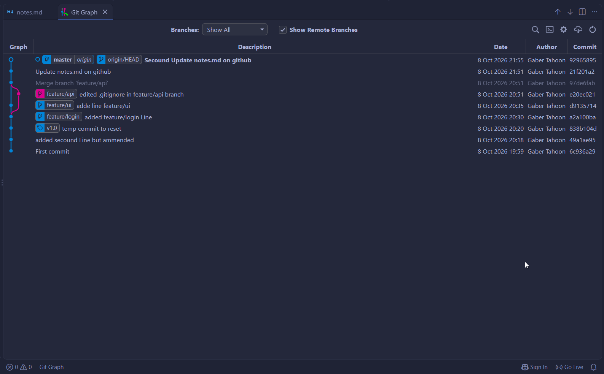
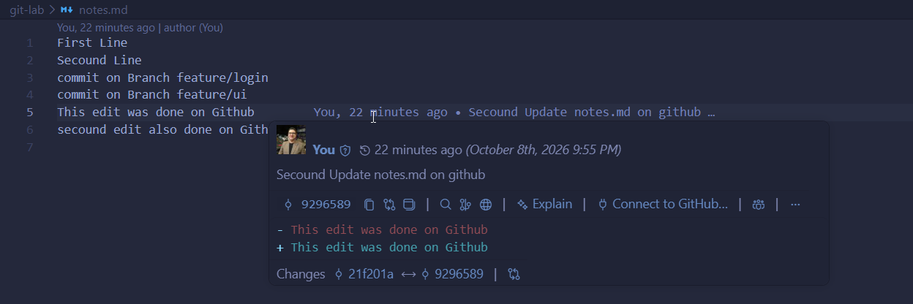
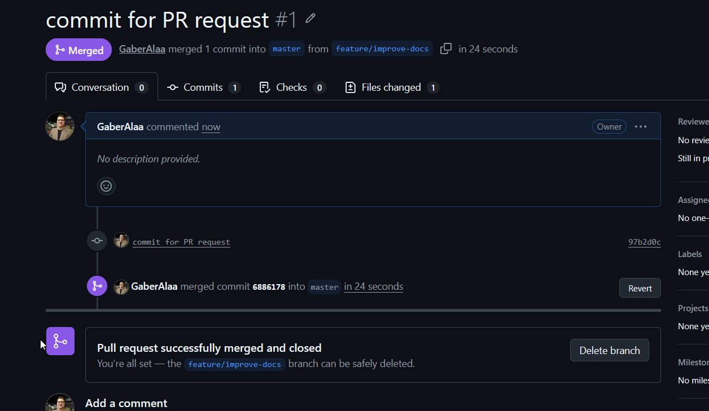

# This Repositorie was used for training on Git and GitHub

**Student Name:** Gaber Tahoon  
**Repository URL:** [git-lab](https://github.com/GaberAlaa/git-lab)

---

## 📌 Part 0: Conceptual Understanding

### 1\. Git vs. SVN & Storage Models

- **Centralized (SVN) vs. Distributed (Git):**

SVN is a centralized version control system where the main repository is located on a central server. Git is distributed, meaning each clone contains its own complete repository history.

- **Deltas vs. Snapshots:**

Delta-based systems mainly represent changes as differences between versions. Git uses a snapshot-based model, where each commit represents the state of the project's files at that point in time.

---

## 🛠️ Task 1: "Git Lab" (Internals, Local Workflow, Undoing, Tags)

### 1\. Git Identity & Initialization

- Output of `git config --list --show-origin`:

```
file:C:/Program Files/Git/etc/gitconfig diff.astextplain.textconv=astextplain
file:C:/Program Files/Git/etc/gitconfig filter.lfs.clean=git-lfs clean -- %f
file:C:/Program Files/Git/etc/gitconfig filter.lfs.smudge=git-lfs smudge -- %f
file:C:/Program Files/Git/etc/gitconfig filter.lfs.process=git-lfs filter-process
file:C:/Program Files/Git/etc/gitconfig filter.lfs.required=true
file:C:/Program Files/Git/etc/gitconfig http.sslbackend=schannel
file:C:/Program Files/Git/etc/gitconfig core.autocrlf=true
file:C:/Program Files/Git/etc/gitconfig core.fscache=true
file:C:/Program Files/Git/etc/gitconfig core.symlinks=false
file:C:/Program Files/Git/etc/gitconfig pull.rebase=false
file:C:/Program Files/Git/etc/gitconfig credential.helper=manager
file:C:/Program Files/Git/etc/gitconfig credential.https://dev.azure.com.usehttppath=true
file:C:/Program Files/Git/etc/gitconfig init.defaultbranch=master
file:C:/Users/gaber/.gitconfig  user.email=192244545+GaberAlaa@users.noreply.github.com
file:C:/Users/gaber/.gitconfig  user.name=Gaber Tahoon
file:C:/Users/gaber/.gitconfig  filter.lfs.clean=git-lfs clean -- %f
file:C:/Users/gaber/.gitconfig  filter.lfs.smudge=git-lfs smudge -- %f
file:C:/Users/gaber/.gitconfig  filter.lfs.process=git-lfs filter-process
file:C:/Users/gaber/.gitconfig  filter.lfs.required=true
```

### 2\. Git Architecture & Internals

- **Object Hashes:**
  - Blob SHA: `603cb1b9ac42dee91c7cdb573b0796d964efeecb`
  - Tree SHA: `50e3fe245916a4988af83210e49edcef329558c1`
  - Commit SHA: `da00e18a58d82d831e1622e152ec26cc7e9c916e`

- **Object Content Inspection (`git cat-file -p`):**

```
PS C:\D partition\SBS\git_week\git-lab> git cat-file -p 603c
First Line

PS C:\D partition\SBS\git_week\git-lab> git cat-file -p 50e3
100644 blob c61f6af07f717d2e10c496e722bbe78a1d886866    .gitignore
100644 blob 603cb1b9ac42dee91c7cdb573b0796d964efeecb    notes.md

PS C:\D partition\SBS\git_week\git-lab> git cat-file -p da00
tree 50e3fe245916a4988af83210e49edcef329558c1
author Gaber Tahoon <192244545+GaberAlaa@users.noreply.github.com> 1791478765 +0300
committer Gaber Tahoon <192244545+GaberAlaa@users.noreply.github.com> 1791478765 +0300

first commit
```

- **Object Type Inspection (`git cat-file -t`):**

```
PS C:\D partition\SBS\git_week\git-lab> git cat-file -t 603cb1
blob
```

- **Staging Area Verification (`git ls-files -s`):**

```
PS C:\D partition\SBS\git_week\git-lab> git ls-files -s
100644 c61f6af07f717d2e10c496e722bbe78a1d886866 0       .gitignore
100644 603cb1b9ac42dee91c7cdb573b0796d964efeecb 0       notes.md
```

- **Brief explanation of the relationship between them:**  
  A commit points to a tree that represents the directory structure at that point in history. The tree points to blobs containing the actual contents of files. Therefore, the commit, tree, and blobs work together to represent the state of the project at a particular point in time.

### 3\. Ignoring Files (`.gitignore`)

- Output of `git status` proving `.env` and temporary files are ignored:

```
PS C:\D partition\SBS\git_week\git-lab> git status --ignored
On branch master
Ignored files:
  (use "git add -f <file>..." to include in what will be committed)
        .env

nothing to commit, working tree clean
PS C:\D partition\SBS\git_week\git-lab>
```

### 4\. Inspecting Changes

```
PS C:\D partition\SBS\git_week\git-lab> git diff
diff --git a/notes.md b/notes.md
index 603cb1b..3b6f68c 100644
--- a/notes.md
+++ b/notes.md
@@ -1 +1,2 @@
 First Line
+secound Line
PS C:\D partition\SBS\git_week\git-lab>
```

```
PS C:\D partition\SBS\git_week\git-lab> git diff --staged
PS C:\D partition\SBS\git_week\git-lab> git add .
PS C:\D partition\SBS\git_week\git-lab> git diff --staged
diff --git a/notes.md b/notes.md
index 603cb1b..3b6f68c 100644
--- a/notes.md
+++ b/notes.md
@@ -1 +1,2 @@
 First Line
+secound Line
PS C:\D partition\SBS\git_week\git-lab>
```

### 5\. Undoing Changes & History Recovery

- Demonstrating `git commit --amend`:

```
PS C:\D partition\SBS\git_week\git-lab> git log --oneline
38487b3 (HEAD -> master) added secound Line
6c936a2 First commit
PS C:\D partition\SBS\git_week\git-lab> git commit --amend -m "added secound Line but ammended"
[master 49a1ae9] added secound Line but ammended
 Date: Thu Oct 8 20:18:30 2026 +0300
 1 file changed, 1 insertion(+)
PS C:\D partition\SBS\git_week\git-lab> git log --oneline
49a1ae9 (HEAD -> master) added secound Line but ammended
6c936a2 First commit
PS C:\D partition\SBS\git_week\git-lab>
```

- Demonstrating `git reset --hard` and recovery via `git reflog`:

```
PS C:\D partition\SBS\git_week\git-lab> git log --oneline
838b104 (HEAD -> master) temp commit to reset
49a1ae9 added secound Line but ammended
6c936a2 First commit
PS C:\D partition\SBS\git_week\git-lab> git reset --hard HEAD~1
HEAD is now at 49a1ae9 added secound Line but ammended
PS C:\D partition\SBS\git_week\git-lab> git log --online
fatal: unrecognized argument: --online
PS C:\D partition\SBS\git_week\git-lab> git log --oneline
49a1ae9 (HEAD -> master) added secound Line but ammended
6c936a2 First commit
PS C:\D partition\SBS\git_week\git-lab> git reflog
49a1ae9 (HEAD -> master) HEAD@{0}: reset: moving to HEAD~1
838b104 HEAD@{1}: commit: temp commit to reset
49a1ae9 (HEAD -> master) HEAD@{2}: commit (amend): added secound Line but ammended
38487b3 HEAD@{3}: commit: added secound Line
6c936a2 HEAD@{4}: commit (amend): First commit
db622ad HEAD@{5}: commit (amend): First commit
378354e HEAD@{6}: commit (amend): added secound Line but ammended
da00e18 HEAD@{7}: commit (initial): first commit
PS C:\D partition\SBS\git_week\git-lab> git reset --hard 838b1
HEAD is now at 838b104 temp commit to reset
PS C:\D partition\SBS\git_week\git-lab> git log --oneline
838b104 (HEAD -> master) temp commit to reset
49a1ae9 added secound Line but ammended
6c936a2 First commit
PS C:\D partition\SBS\git_week\git-lab>
```

### 6\. Tagging

- Output of `git show v1.0` (Annotated tag):

```
PS C:\D partition\SBS\git_week\git-lab> git show v1.0
tag v1.0
Tagger: Gaber Tahoon <192244545+GaberAlaa@users.noreply.github.com>
Date:   Thu Oct 8 20:27:04 2026 +0300

Version 1.0 release

commit 838b104dbb7ee6ef5cb62d88a5f8ebbfada19fb5 (HEAD -> master, tag: v1.0)
Author: Gaber Tahoon <192244545+GaberAlaa@users.noreply.github.com>
Date:   Thu Oct 8 20:20:45 2026 +0300

    temp commit to reset

diff --git a/notes.md b/notes.md
index 588e527..f4a1ed4 100644
--- a/notes.md
+++ b/notes.md
@@ -1,2 +1,3 @@
-First Line
-Secound Line
+First Line
+Secound Line
+temp third Line for reset test
PS C:\D partition\SBS\git_week\git-lab>
```

---

## 🌿 Task 2: "Branch Battle" (Branching, Merging & Rebase)

### 1\. Fast-Forward Merge

- Branch merged: `feature/login` into `main`
- Terminal output / confirmation message:

```
PS C:\D partition\SBS\git_week\git-lab> git merge feature/login
Updating 838b104..a2a100b
Fast-forward
 notes.md | 2 +-
 1 file changed, 1 insertion(+), 1 deletion(-)
PS C:\D partition\SBS\git_week\git-lab>
```

### 2\. Three-Way Merge

- Merge commit created when combining diverging branches (`feature/ui` & `feature/api`):

```
PS C:\D partition\SBS\git_week\git-lab> git merge feature/api
Merge made by the 'ort' strategy.
 .gitignore | 1 +
 1 file changed, 1 insertion(+)
PS C:\D partition\SBS\git_week\git-lab> git log --oneline
97de6fa (HEAD -> master) Merge branch 'feature/api'
e20ec02 (feature/api) edited .gitignore in feature/api branch
d913571 (feature/ui) adde line feature/ui
a2a100b (feature/login) added feature/login Line
838b104 (tag: v1.0) temp commit to reset
49a1ae9 added secound Line but ammended
6c936a2 First commit
PS C:\D partition\SBS\git_week\git-lab>
```

### 3\. Merge Conflict Resolution

- Screenshot of the conflict markers (`<<<<<<<`, `=======`, `>>>>>>>`): _(Insert screenshot here)_
- Resolved commit message & terminal verification:

```
First Line
Secound Line
<<<<<<< HEAD
commit on Branch feature/login
commit on Branch feature/ui
=======
commit on Branch feature/login

commit on branch feature/api
>>>>>>> feature/api

```

### 4\. Linear History (Rebase vs. Merge)

- **Rebase Comparison:**  
  A merge preserves the original branching history and may create a merge commit when branches have diverged. A rebase moves the feature commits onto the latest main commit, producing a more linear history

### 5\. Repository Visual Graph

- Output of `git log --oneline --graph --all`:

```
PS C:\D partition\SBS\git_week\git-lab> git log --oneline --graph --all
*   97de6fa (HEAD -> master) Merge branch 'feature/api'
|\
| * e20ec02 (feature/api) edited .gitignore in feature/api branch
* | d913571 (feature/ui) adde line feature/ui
|/
* a2a100b (feature/login) added feature/login Line
* 838b104 (tag: v1.0) temp commit to reset
* 49a1ae9 added secound Line but ammended
* 6c936a2 First commit
PS C:\D partition\SBS\git_week\git-lab>
```

---

## 🌐 Task 3: "Remote & Open-Source Workflow" (Solo Simulation)

### 1\. SSH Authentication

- Verification output of `ssh -T git@github.com`:

```
Hi GaberAlaa! You've successfully authenticated, but GitHub does not provide shell access.
```

### 2\. Synchronization: `git fetch` vs `git pull`

- Output showing the difference after a remote commit was fetched:

```
PS C:\D partition\SBS\git_week\git-lab> git fetch origin master
remote: Enumerating objects: 5, done.
remote: Counting objects: 100% (5/5), done.
remote: Compressing objects: 100% (3/3), done.
remote: Total 3 (delta 1), reused 0 (delta 0), pack-reused 0 (from 0)
Unpacking objects: 100% (3/3), 1011 bytes | 18.00 KiB/s, done.
From github.com:GaberAlaa/git-lab
 * branch            master     -> FETCH_HEAD
   21f201a..9296589  master     -> origin/master
```

```
PS C:\D partition\SBS\git_week\git-lab> git pull origin master
From github.com:GaberAlaa/git-lab
 * branch            master     -> FETCH_HEAD
Updating 21f201a..9296589
Fast-forward
 notes.md | 5 +++--
 1 file changed, 3 insertions(+), 2 deletions(-)
PS C:\D partition\SBS\git_week\git-lab>
```

### 3\. VS Code & GitLens Inspection

- Screenshot showing GitLens commit graph and inline blame: _(Insert screenshot here)_



---



### 4\. Independent Contribution & PR Simulation

- Secondary Repository URL (`git-lab`): `https://github.com/GaberAlaa/git-lab`
- Remote Configuration (`git remote -v`):

```
PS C:\D partition\SBS\git_week\git-lab> git remote -v
origin  git@github.com:GaberAlaa/git-lab.git (fetch)
origin  git@github.com:GaberAlaa/git-lab.git (push)
```

- **Pull Request Link:** `https://github.com/GaberAlaa/git-lab/pull/1`
- Screenshot of the merged PR on GitHub: _(Insert screenshot here)_


